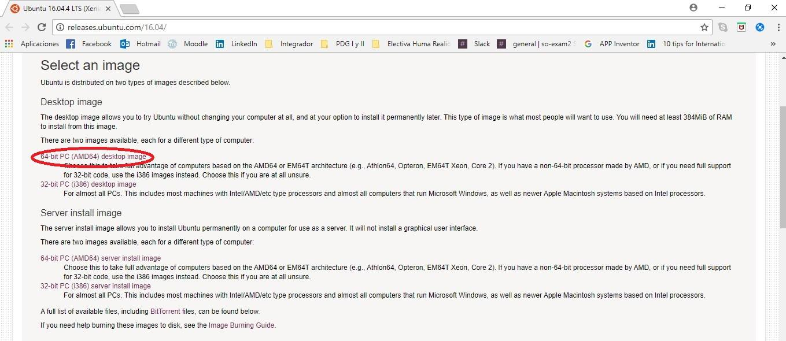
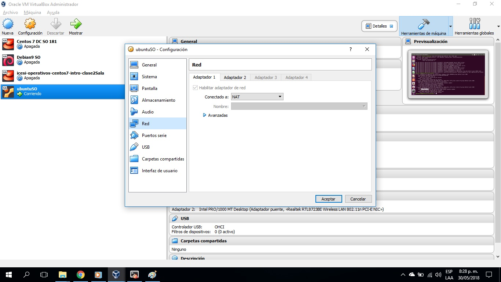
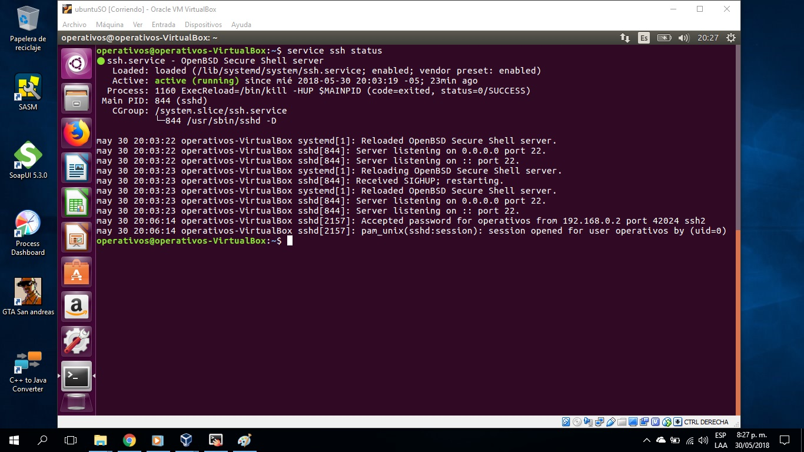

# Proyecto Final Sistemas Operativos

**Nombre:** David Felipe Cobo Plazas

**Código:** A00309844

**URL repositorio:** https://github.com/davidcobogithub/so-project.git

**Tabla de Contenido**

  - [1. Aprovisionamiento básico de máquina virtual con Ubuntu 16.04.4 LTS (xenial)]()
  - [2. Instalación de LXC/LXD con permisos para el usuario]()
  - [3. Creación de contenedores con servicio web]()
  - [4. Creación de contenedor con servicio de balanceo de carga()
  - [5. Pruebas del funcionamiento del balanceador de carga()
  - [6. Configuración para permitir el acceso desde el sistema anfitrión al contenedor con el servicio para balanceo de carga()
  - [7. Referencias]()

# Solución Proyecto Final

##  1. Aprovisionamiento básico de máquina virtual con Ubuntu 16.04.4 LTS (xenial)
 
**1.** Para obtener la imagen del sistema Ubuntu 16.04.4 LTS (xenial) se ingresa al siguiente enlace [Ubuntu 16.04.4 LTS](http://releases.ubuntu.com/16.04/)

**2.** Una vez ha ingresado al enlace, damos click en la opción 64-bit PC (AMD64) desktop image, que descarga la imagen de escritorio .ISO para computadores de 64 bits.

**3.** Tal como se ve en la siguiente imagen, al dar click comenzará la descarga del sistema que tiene un tamaño de 1.5GB. 



**4.** Una vez ha terminado la descarga por completo de la imagen, abrimos VirtualBox y creamos una nueva máquina virtual tipo Linux y versión Ubuntu (64-bit).

**5.** Realizadas las configuraciones de memoria, disco duro, nombre de la máquina y ha sido creada correctamente; selecconamos la máquina creada y damos click en la opción Configuración.

**6.** Procedemos a configurar a la máquina la cantidad de procesadores (mínimo 4) y las opciones de red.

**7.** En la opción Red, habilitamos el primer adaptador de red y seleccionamos la opción Conectado a NAT, como lo muestra la imagen:



**8.** Luego en la opción Adaptador 2, también habilitamos el adaptador de red y seleccionamos la opción Conectado a Adaptador puente, como lo muestra la imagen:


**9.** Una vez terminadas las configuraciones iniciales podemos iniciar la ejecución de la máquina virtual de Ubuntu.

**10.** Ya ha iniciado la máquina correctamente muestra un mensaje bienvenida como se observa en la siguiente imagen:


**11.** Allí se selecciona el idioma Español y damos click en el botón Instalar Ubuntu.

**12.** Luego, seleccionamos las opciones según nuestra preferencia de uso.

**13.** En el Tipo de instalación damos click en la opción Borrar disco e instalar Ubuntu, como se muestra en la siguiente imagen. Esto se hace cuando se hará un reset completo del sistema o se va a instalar por primera vez, como en este caso.


**14.** Una vez se han seleccionado las opciones según nuestra preferencia de uso. Llegamos al paso de la creación de Usuario del Sistema. En este caso, mi usuario tiene el nombre operativos. Luego, se agrega la contraseña de usuario y comenzará la instalción del sistema.

**15.** Cuando la instalación ha finalizado correctamente se muestra el siguiente mensaje:


**16.** Finalmente, ya hemos instalado correctamente el sistema Ubuntu 16.04.4 LTS (xenial) y para usarlo debemos ingresar la contraseña del usuario operativos, como lo muestra la imagen:


**17.** Una vez ingresamos al sistema, abrimos la consola Terminal para realizar la configuración de conexiones ssh.

**18.** Debemos instalar la herramienta ssh, para ello, ejecutamos el comando ```sudo apt-get install ssh``` 

**19.** Una vez se ha instalado correctamente ssh, para iniciar el servicio ejecutamos el comando ```sudo etc/init.d/ssh start```

**20.** Podemos verificar que el servicio ssh está activo con el comando ```service ssh status```. Debe aparecer tal cual como se muestra en la siguiente imagen: 



**21.** Una vez está corriendo ssh activo correctamente, ya podemos iniciar una conexión ssh a nuestra máquina, por medio por ejemplo de Putty.

##  2. Instalación de LXC/LXD con permisos para el usuario
