# Proyecto Final Sistemas Operativos

**Nombre:** David Felipe Cobo Plazas

**Código:** A00309844

**URL repositorio:** https://github.com/davidcobogithub/so-project.git

**Tabla de Contenido**

  - [1. Aprovisionamiento básico de máquina virtual con Ubuntu 16.04.4 LTS (xenial)](#1-aprovisionamiento-básico-de-máquina-virtual-con-ubuntu-16044-lts-xenial)
  - [2. Instalación de LXC/LXD con permisos para el usuario](#2-instalación-de-lxclxd-con-permisos-para-el-usuario)
  	- [2.1. Storage Pool](#21-storage-pool)
	- [2.2. ZFS y sus ventajas](#22-zfs-y-sus-ventajas)
  - [3. Creación de contenedores con servicio web](#3-creación-de-contenedores-con-servicio-web)
  - [4. Creación de contenedor con servicio de balanceo de carga](#4-creación-de-contenedor-con-servicio-de-balanceo-de-carga)
  - [5. Pruebas del funcionamiento del balanceador de carga](#5-pruebas-del-funcionamiento-del-balanceador-de-carga)
  - [6. Configuración para permitir el acceso desde el sistema anfitrión al contenedor con el servicio para balanceo de carga](#6-configuración-para-permitir-el-acceso-desde-el-sistema-anfitrión-al-contenedor-con-el-servicio-para-balanceo-de-carga)
  - [7. Preguntas Opcionales](#7-preguntas-opcionales)
  - [8. Referencias](#8-referencias)

# Solución Proyecto Final

##  1. Aprovisionamiento básico de máquina virtual con Ubuntu 16.04.4 LTS (xenial)
 
**1.** Para obtener la imagen del sistema Ubuntu 16.04.4 LTS (xenial) se ingresa al siguiente enlace [Ubuntu 16.04.4 LTS](http://releases.ubuntu.com/16.04/)

**2.** Una vez ha ingresado al enlace, damos click en la opción 64-bit PC (AMD64) desktop image, que descarga la imagen de escritorio .ISO para computadores de 64 bits.

**3.** Tal como se ve en la siguiente imagen, al dar click comenzará la descarga del sistema que tiene un tamaño de 1.5GB. 


**4.** Una vez ha terminado la descarga por completo de la imagen, abrimos VirtualBox y creamos una nueva máquina virtual tipo Linux y versión Ubuntu (64-bit).

**5.** Realizadas las configuraciones de memoria, disco duro, nombre de la máquina y ha sido creada correctamente; selecconamos la máquina creada y damos click en la opción Configuración.

**6.** Procedemos a configurar a la máquina la cantidad de procesadores (mínimo 4) y las opciones de red.

**7.** En la opción Red, habilitamos el primer adaptador de red y seleccionamos la opción Conectado a NAT, como lo muestra la imagen:


**8.** Luego en la opción Adaptador 2, también habilitamos el adaptador de red y seleccionamos la opción Conectado a Adaptador puente, como lo muestra la imagen:


**9.** Una vez terminadas las configuraciones iniciales podemos iniciar la ejecución de la máquina virtual de Ubuntu.

**10.** Ya ha iniciado la máquina correctamente muestra un mensaje bienvenida como se observa en la siguiente imagen:

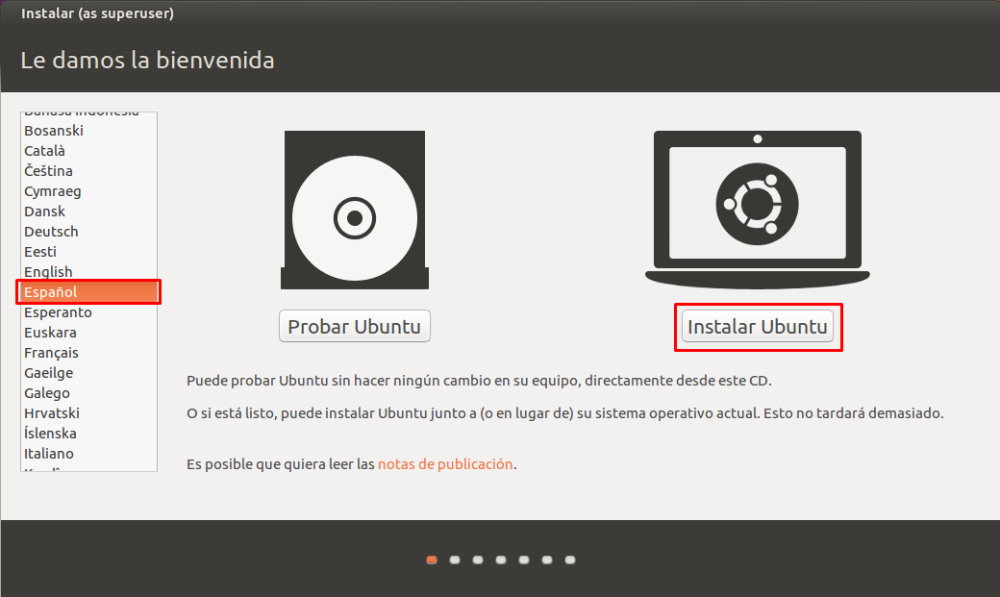

**11.** Allí se selecciona el idioma Español y damos click en el botón Instalar Ubuntu.

**12.** Luego, seleccionamos las opciones según nuestra preferencia de uso.

**13.** En el Tipo de instalación damos click en la opción Borrar disco e instalar Ubuntu, como se muestra en la siguiente imagen. Esto se hace cuando se hará un reset completo del sistema o se va a instalar por primera vez, como en este caso.

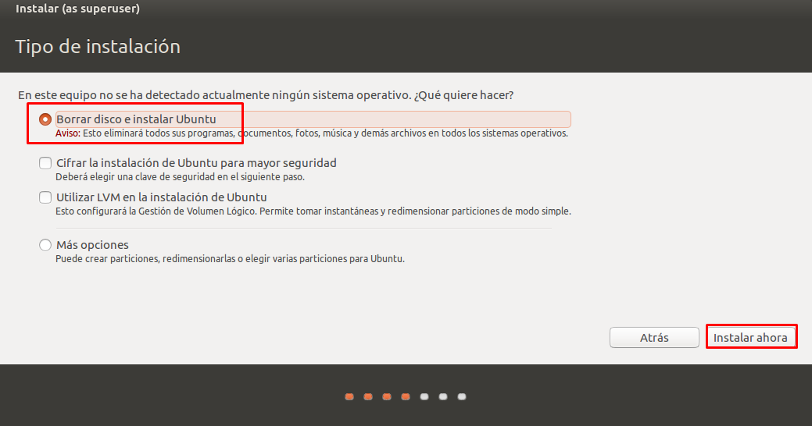

**14.** Una vez se han seleccionado las opciones según nuestra preferencia de uso. Llegamos al paso de la creación de Usuario del Sistema. En este caso, mi usuario tiene el nombre operativos. Luego, se agrega la contraseña de usuario y comenzará la instalción del sistema.

**15.** Cuando la instalación ha finalizado correctamente se muestra el siguiente mensaje:

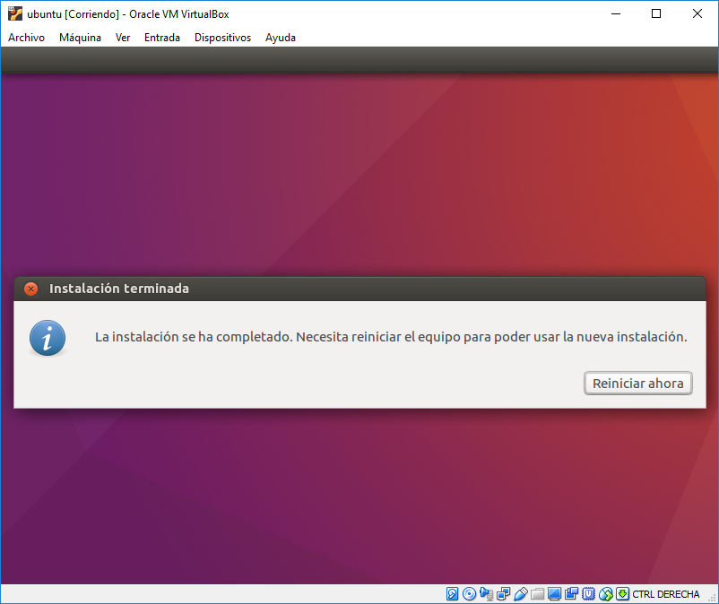

**16.** Finalmente, ya hemos instalado correctamente el sistema Ubuntu 16.04.4 LTS (xenial) y para usarlo debemos ingresar la contraseña del usuario operativos, como lo muestra la imagen:

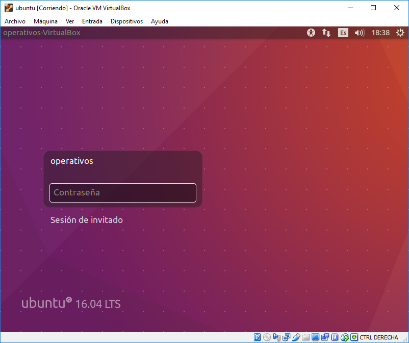

**17.** Una vez ingresamos al sistema, abrimos la consola Terminal para realizar la configuración de conexiones ssh.

**18.** Debemos instalar la herramienta ssh, para ello, ejecutamos el comando ```sudo apt-get install ssh``` 

**19.** Una vez se ha instalado correctamente ssh, para iniciar el servicio ejecutamos el comando ```sudo etc/init.d/ssh start```

**20.** Podemos verificar que el servicio ssh está activo con el comando ```service ssh status```. Debe aparecer tal cual como se muestra en la siguiente imagen: 


**21.** Una vez está corriendo ssh activo correctamente, ya podemos iniciar una conexión ssh a nuestra máquina, por medio por ejemplo de Putty.

##  2. Instalación de LXC/LXD con permisos para el usuario

**1.** Instalamos Hypervisor LXD, el cual es un administrador de contenedores de linux y que sirve de complemento para LXC. Se debe ejecutar el comando ```sudo apt install lxd lxd-client```. Comenzará la instalación tal como se muestra en la siguiente imagen.

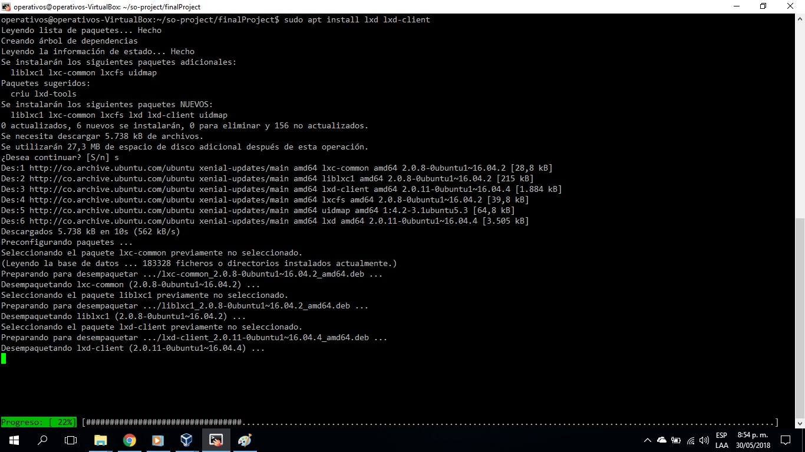

**2.** LXC permite ejecutar diferentes contenedores aislados en una máquina Linux. Un contenedor es como un entorno virtual, con su propio espacio de procesos y de red. La tecnología LXC utiliza Linux kernel control groups (Cgroups) y Namespaces para proporcionar este aislamiento.

LXD es un complemento que adiciona características sobre LXC tales como una interfaz REST para la gestión de contenedores a través de la red.

**3.** Con el comando ```usermod -aG sudo operativos``` se agrega al grupo de sudoers el usuario operativos para que permita usar el comando sudo para dar permisos root.

**4.** ZFS, es un sistema de archivos que mejora la eficiencia de almacenamiento y velocidad de respuesta entre contenedores. Permite usar solo el espacio en disco de una sola imagen de contenedor, para muchos contenedores, y cada cambio a un contenedor particular se hace en otro bloque de datos y se referencia.

**5.** Debemos instalar la herramienta zfsutils-linux. Para ello, el siguiente comando: ```sudo apt-get install zfsutils-linux```

**6.** Al ejecutar el comando anterior, comienza la instalación de ZFS, como se muestra en la siguiente imagen:

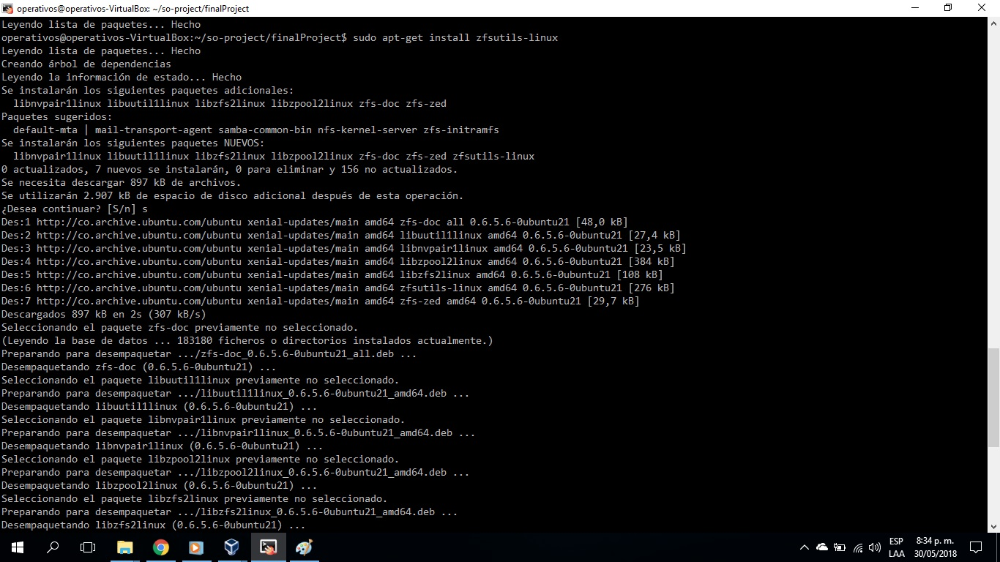

## 2.1 Storage Pool

Un storage pool o grupo de almacenamiento es un entorno de almacenamiento compartido que trabaja como un solo sistema en general. Pueden configurarse en diferentes tamaños y proporcionar una serie de beneficios, que incluyen mejoras de rendimiento, administración y proteccion de datos. Las agrupaciones pueden aprovisionarse para incluir cualquier cantidad de capacidad y utilizar cualquier combinación de espacio de almacenamiento físico en una red de area de almacenamiento (SAN). En entornos de servidor virtual, las máquinas virtuales se pueden almacenar en grupos dedicados, lo que garantiza que las máquinas virtuales críticas tengan acceso a la cantidad adecuada de almacenamiento.

## 2.2 ZFS y sus ventajas

ZFS es un sistema de archivos de código abierto creado por Sun Microsystem que provee sistemas contra pérdida y corrupción de datos, logrando proteger la información del sistema. Además, ayuda a gestionar el contenido que se almacena en disco en un formato propio con un esquema de direccionamiento de 128 bits y puede almacenar hasta 275 mil millones de TeraBytes por grupo de almacenamiento.

Sus principales ventajas son:

 * Integridad de datos comparable: Esta característica permite que los archivos se mantengan correctamente, siendo capaz de detectar archivos corruptos y arreglarlos automaticamente, esto se logra a través de un modelo transaccional.

 * Modelo transaccional: Consiste en el almacenamiento de eventos para que al ser modificados archivos en el disco duro, estos no sean sobreescritos de forma automática sino que se crea un nuevo espacio donde estos datos son grabados y luego se modifican los apuntadores del archivo original para que hagan referencia al nuevo fichero.

 * Snapshots: Son copias del sistema de archivo de fácil creación, permitiendo hacer respaldo de la información o copias de seguridad de forma casi inmediata, con la característica de que son de solo lectura.

 * Clones de escritura: Al igual que los Snapshots, son copias de respaldo del sistema de información con la caracterpistica de hacer escritura.

 * Depuración: ZFS puede programarse para realizar un "scrub" sobre todos los datos en un pool de almacenamiento, con el objetivo de verificar su integridad, detectar cualquier corrupción de datos silenciosos y corregir cualquier error donde sea posible. Cuando los datos se almacenan de forma redundante, se pueden autorreparar automáticamente y sin intervención del administrador.

**7.** Siguiendo con la configuración del puente LXD (LXD bridge configuration) por medio del cual, los contenedores se van a comunicar en la red. Para ello vamos a ejecutar el comando ```sudo lxd init```

**8.** Posteriormente, se realiza la configuración inicial de los contenedores tal y como se muestra en la siguente imagen:

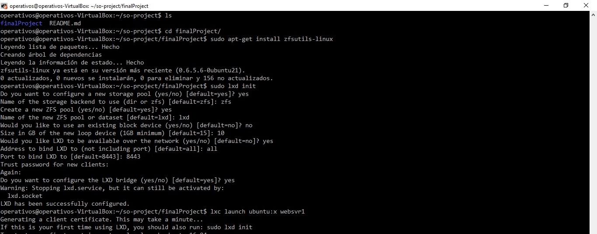

**9.** Luego aparecerá una configuración por interfaz gráfica para configurar el puente LXD, aquí algunas capturas de pantalla del proceso:

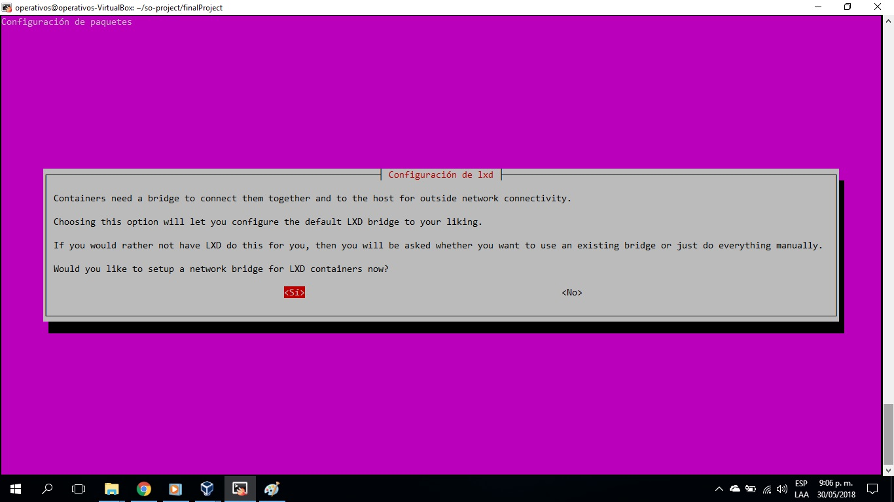

**10.** Nos preguntara si deseamos configurar la conectividad por IPv4, seleccionamos la opción Sí.

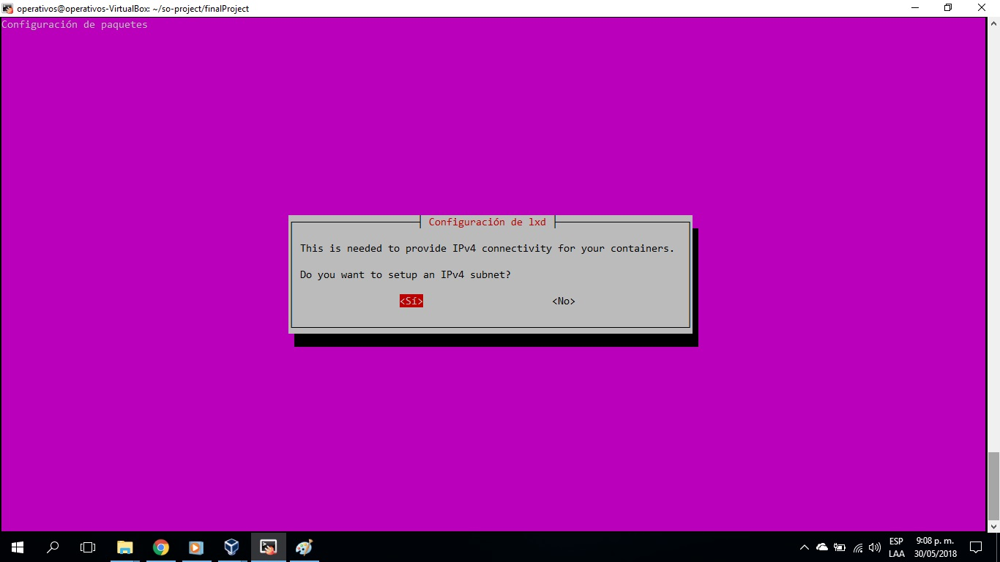 

**11.** Debemos indicar una dirección IPv4. En mi caso dejo que aparece por default, como se ve en la imagen.

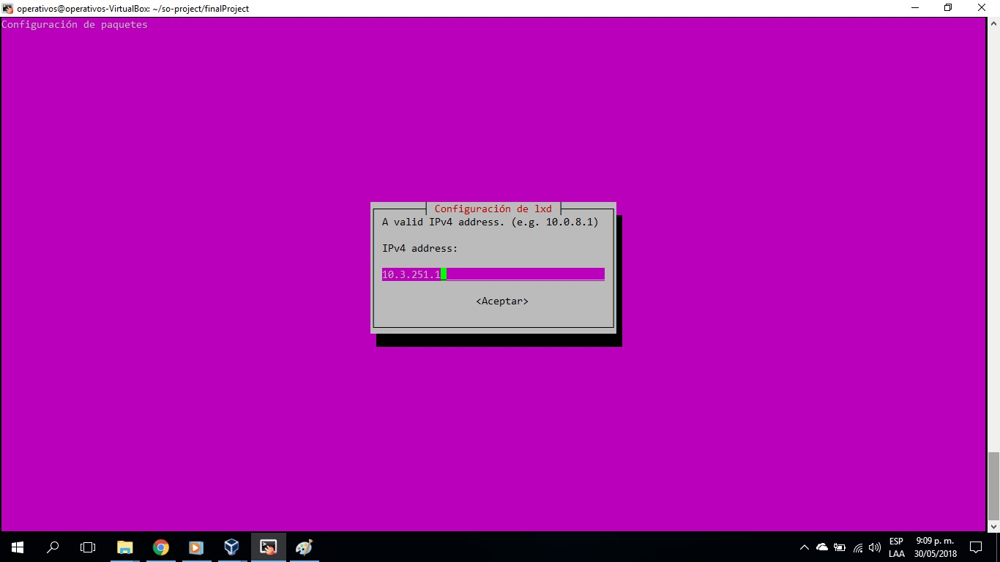

**12.** De igual manera, se realiza lo mismo para las direcciones ip para la máscara de subred, DHCP y clientes DHCP.

**13.** Luego, nos pregunta si queremos intercambiar paquetes por medio de NAT y seleccionamos la opción Si con el objetivo que haya una IP que nos permita navegar a internet, como se ve en la figura.

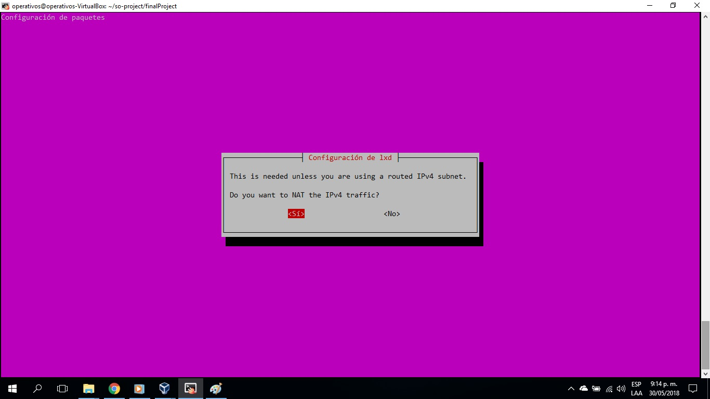

**14.** Para finalizar, cuando nos pregunta si deseamos realizar una configuración para IPv6 le damos en la opción no y ya habremos terminado de realizar la configuración exitosamente.

##  3. Creación de contenedores con servicio web

**1.** Para crear los contenedores que tendran el servicio web usamos el comando ```lxc launch ubuntu:x websvr1```. Cabe anotar que yo le puse como nombre al servidor websvr1. 

**2.** Si es la primera vez que se crea un contenedor web, se va a realizar la descarga de la imagen de ubuntu 16.04 xenial.

**3.** Luego, debemos ingresar a cada contenedor para configurar el servidor web, con el comando:

```
lxc exec websvr1 -- sudo --login --user root
```

**4.** Una vez ingresamos al servidor web 1, instalamos Nginx para la configuración del servidor web con el comando:

```
sudo apt-get install nginx
```

**5.** En caso de no poderse realizar por primer vez la instalación de Nginx, debemos realizar una actualización del sistema con el comando ```sudo apt-get update```. Como se ve en la imagen:

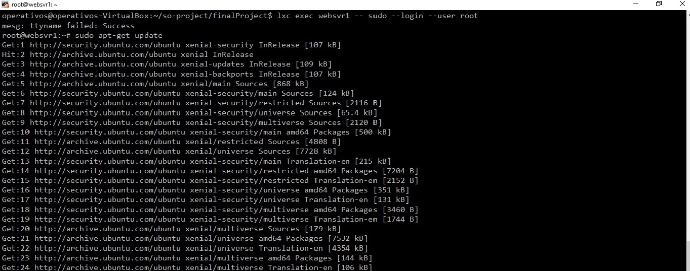

**6.** Con el comando  ```sudo nano /var/www/html/index.nginx-debian.html``` ingresamos al código de la página web por default del sevidor, el cual podemos ingresar y modificar el texto para mostrar que esta página web pertenece al servidor web 1.

**7.** Podemos reiniciar el servicio Nginx del contenedor del webserver1 usando el comando ```sudo service nginx restart```

**8.** También podemos verificar el estado del servidor con  Nginx, usando el comando ```sudo service nginx status```

**9.** Salimos del contenedor del servicio web con el comando ```logout```

**10.** Exactamente los mismos pasos anteriores debemos realizar para los contenedores webserver2 y el loadBalancer.  

**11.** Tiendo en cuenta que para el webserver2 usé el comando ```lxc launch ubuntu:x websvr1``` y para el balanceador de carga ```lxc launch ubuntu:x loadBalancer```

**12.** Para acceder al webserver2 usé el comando ```lxc exec websvr2 -- sudo --login --user root``` y para el balanceador de carga ```lxc exec loadBalancer -- sudo --login --user root```

**13.** De igual manera, ingresamos al código de la página web para el webserver2 y para el balanceador de carga y modificamos el texto para diferenciar las páginas de cada contenedor.

**14.** Salimos del contenedor en el que estámos y validamos que los servicios web están activos con los comandos:

```
sudo systemctl enable lxd

sudo systemctl start lxd

```

**15.** También podemos ver la descripción de cada contenedor web con el comando ```lxc list```, y nos dara el resultado como se ve en la siguiente imagen:

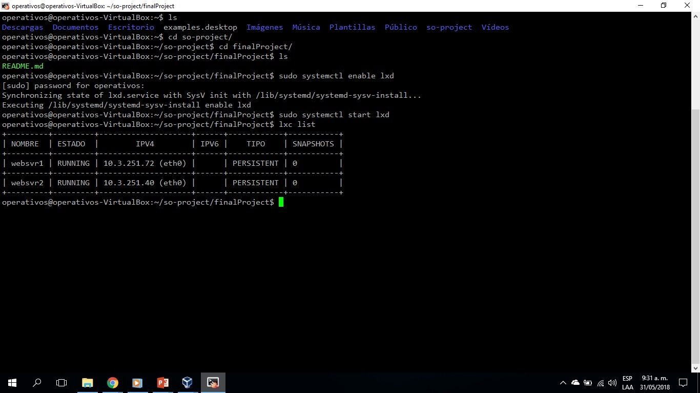

**16.** Podemos ver como respuesta de cada uno de los servicios web utilizando peticiones por medio de curl con el comando ```curl http://10.3.251.72/```. Siendo la dirección ip del web server 1 y nos mostrará el resultado como se ve en la siguiente imagen:

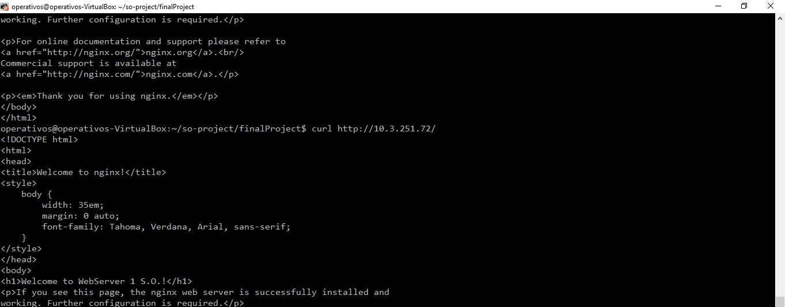

**17.** Asignamos un procesador único para cada servicio web ejecutando los siguientes comandos:

```
lxc config set websrv1 limits.cpu 1 		(Para el servidor web 1)

lxc config set websrv2 limits.cpu 1 		(Para el servidor web 2)
```

## 4. Creación de contenedor con servicio de balanceo de carga

**1.** Previamente, ya habíamos creado, ingresado e instalado Nginx en el balanceador de carga. 

**2.** Posteriormente, realizamos la configuración del balanceador de carga, creando un archivo vacío de configuración con el comando ```sudo nano /etc/nginx/conf.d/load-balancer.conf```

**3.** Dentro del archivo creado ingresaremos la siguiente configuración:

```
upstream backend {

# least_conn es un método tipo least connection, el cual dirige las solicitudes al servidor con las conexiones menos activas en ese momento.
# server 10.3.251.72, es la ip del servidor web 1. 
# server 10.3.251.40, es la ip del servidor web 2. 

   least_conn;
   server 10.60.248.73; 
   server 10.60.248.86;
}

# listen 80, se define para que el balanceador de carga escuche a los servidores por el puerto 80.
# proxy_pass http://backend, define el paso tipo proxy a los servidores denidos en el método backend.

server {
   listen 80; 

   location / {
      proxy_pass http://backend;
   }
}
```

**4.** Para Ubuntu, se debe eliminar la página por default. Esto lo hacemos para que las peticiones no accedan al sitio web sino que pasen por el balanceador de carga. Para esto utilizamos el comando ```sudo rm /etc/nginx/sites-enabled/default```

**5.** Luego, reiniciamos el servicio nginx con el comando ```sudo service nginx restart``` y nuestro balanceador de carga ya funcionará correctamente.

**6.** Podemos revisar el estado del balanceador de carga con el comando ```sudo service nginx status``` y veremos que está activo como se muestra en la siguiente imagen:

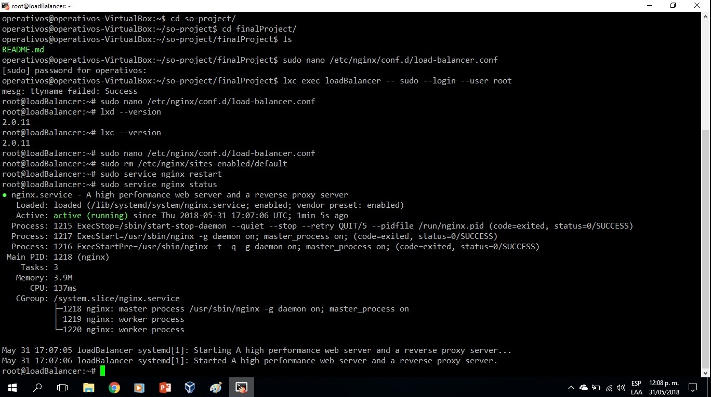

**7.** Finalmente, salimos del balanceador de carga y ya podemos realizar peticiones por medio del comando:

```
curl http://10.3.251.14/
``` 
como respuesta de cada uno de los servicios web a través del balanceador de carga. La ip es la del balanceador y cada ejecución muestra la página de cada servidor web, como se muestra en la siguiente imagen:

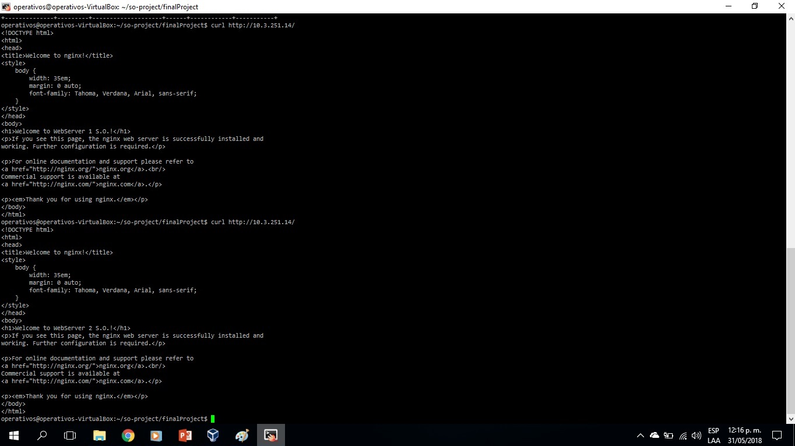

**8.** Para realizar la validación de que el servicio para la conexión remota y el balanceador estén activos por medio de systemctl utilizamos el comando ```systemctl list-unit-files --state=enabled | grep lxd``` y vemos que está enabled.

**9.** Finalmente, salimos del balanceador de carga y con el comando ```lxc list``` vemos la salida de la lista de contenedores creados y sus direcciones IP, como se observa en la siguiente imagen:

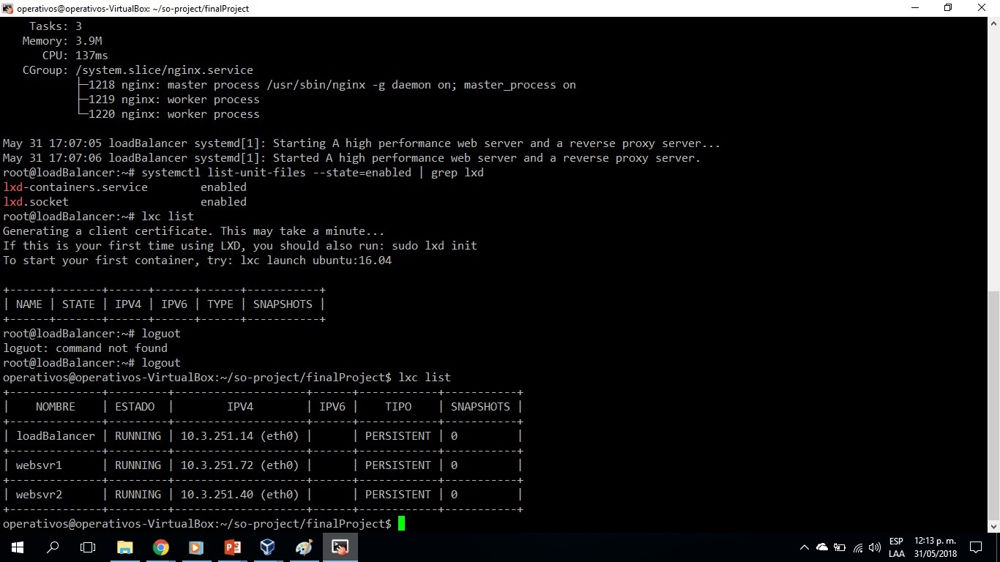

## 5. Pruebas del funcionamiento del balanceador de carga

**1.** Instalamos la herramienta Siege para realizar pruebas de estrés a los servicios web con el comando:

```
sudo apt-get install siege
```

**2.** Una vez se ha instalado correctamente la herramienta siege, cambiamos el porcentaje de CPU y de memoria RAM con los siguientes comandos:

```
lxc config set webserver# limits.cpu.allowance ?%
lxc config set webserver# limits.memory ?MB

Siendo '?' el número de porcentaje a ser asignado
```

**3.** Para ejecutar las pruebas con los porcentajes previamente definidos utilizamos el comando:

```
sudo siege -c 100 -t 10s http://10.3.251.14/
```
en la que el número 100 se refiere a la cantidad de clientes y el número 10 se refiere al tiempo de ejecución de la prueba antes de dar el resultado. La ip definida es la del balanceador de carga.

**4.** Pruebas para la CPU al 50% y RAM a 64MB:

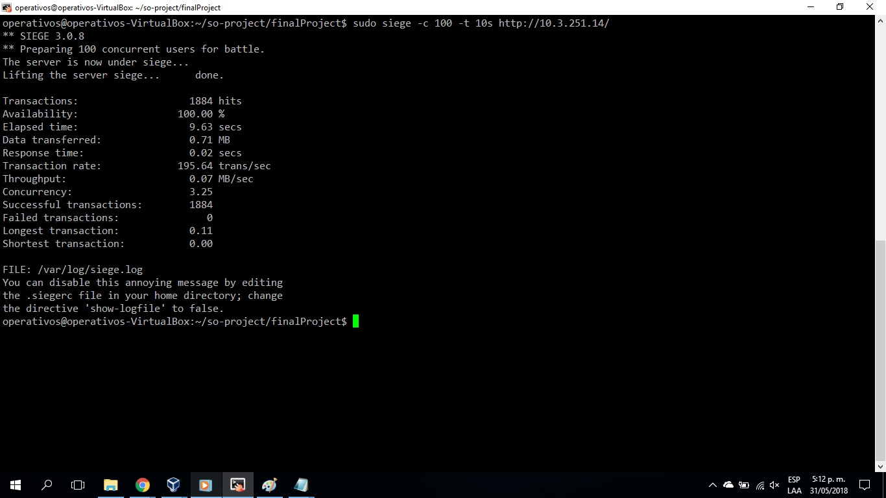

**5.** Pruebas para la CPU al 50% y RAM a 128MB:


**6.** Pruebas para la CPU al 100% y RAM a 64MB:

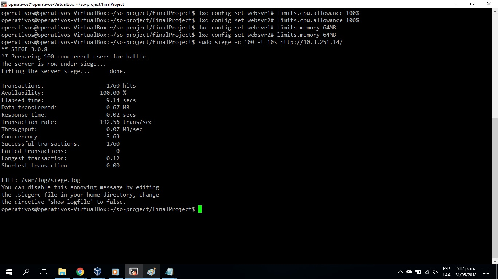

**7.** Pruebas para la CPU al 100% y RAM a 128MB:

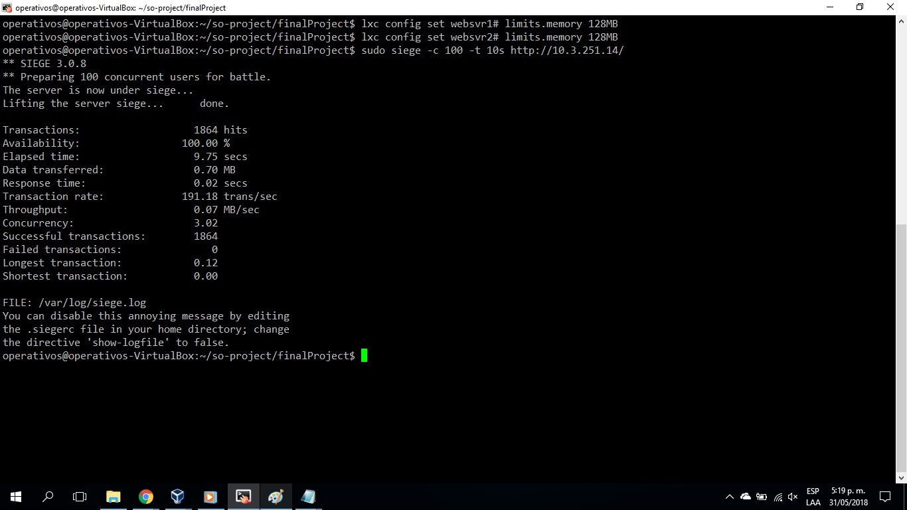

## 6. Configuración para permitir el acceso desde el sistema anfitrión al contenedor con el servicio para balanceo de carga

**1.** Para permitir las peticiones al balanceador de carga desde el Sistema Operativo anfitrión se debe crear una regla de iptables en el sistema de Ubuntu, por medio del siguiente comando:

```
sudo iptables -t nat -A PREROUTING -p tcp -m conntrack --ctstate NEW --dport 80 -j DNAT --to-destination 10.3.251.14:80

Como lo definimos anteriormente, ponemos la dirección ip de nuestro balanceador de carga que escuchará las peticiones por el puerto 80
```

**2.** Por medio de cualquier navegador, en mi caso Chrome, se hacen peticiones al servidor escribiendo la IP con la que hacemos nuestra conexión ssh en el buscador del navegador, en mi caso fue la 172.30.174.9. Cada vez que recarguemos la página se cambiará el servidor al que estemos accediendo como se ve en la siguiente imagen:

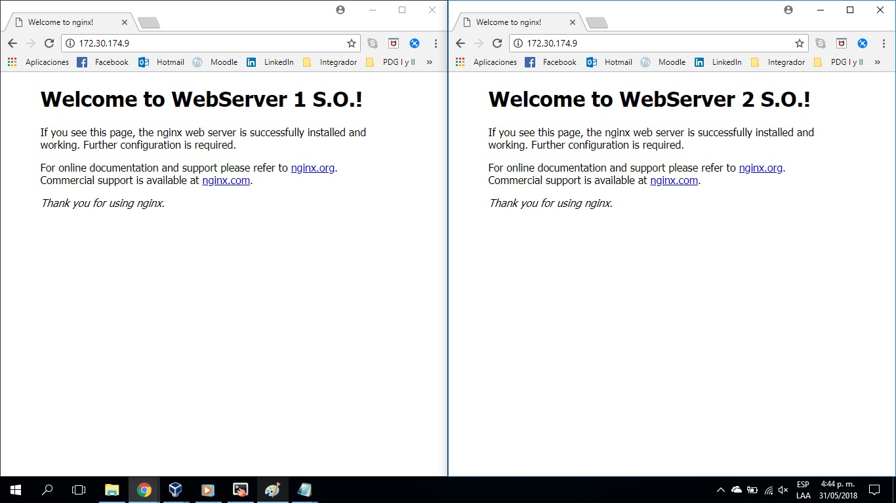

## 7. Preguntas Opcionales

¿Al reiniciar la máquina virtual en que estado quedan los contenedores?

R// Cuando se reinicia la maquina virtual, los contenedores quedan en el último estado que se encontraban, ya sea en estado RUNNING o STOPPED. Se debe tener en cuenta que al apagar la máquina se envía a todos los contenedores una señal de apagado a la que tienen unos segundos para responder y hacer un apagado limpio de cada contenedor. Después de eso, si el contenedor sigue funcionando, será terminado forzadamente por LXD. Al iniciar de nuevo la máquina, todos los contenedores que estaban funcionando en el momento en que se apagó el sistema se volverán a arrancar normalmente.

## 8. Referencias

https://www.digitalocean.com/community/tutorials/how-to-set-up-and-use-lxd-on-ubuntu-16-04

https://www.digitalocean.com/community/tutorials/how-to-list-and-delete-iptables-firewall-rules

https://www.digitalocean.com/community/tutorials/an-introduction-to-load-testing

https://stgraber.org/2016/03/11/lxd-2-0-introduction-to-lxd-112/

https://stgraber.org/2016/03/26/lxd-2-0-resource-control-412/

https://stgraber.org/2016/04/18/lxd-api-direct-interaction/

http://pylxd.readthedocs.io/en/latest/usage.html
